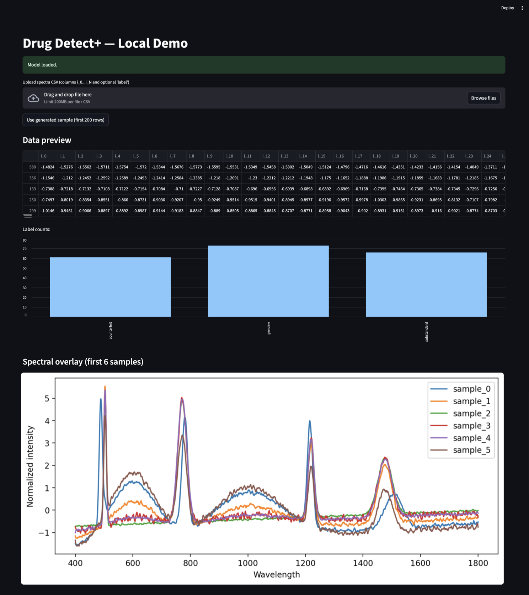

# 💊 Drug Detect+: AI-Powered Fake Medicine Detection

> 🚀 An AI-powered system to identify **fake** and **substandard** medicines using **spectral data**.  
> Built with 💻 Python + 🤖 Machine Learning + 📊 Streamlit.  

---

## 🌟 Overview
Counterfeit & substandard drugs are a huge problem worldwide.  
This project, **Drug Detect+**, is a **proof-of-concept prototype** that uses spectral fingerprints of medicines to classify them as:

- ✅ Genuine  
- ⚠️ Substandard  
- ❌ Counterfeit  

We **simulate spectral data** in this project (because real lab data requires spectrometers 🧪). But the **ML pipeline, preprocessing, and UI are real** and can directly work with real-world data when available.

---

## 🛠️ Tech Stack
- **Language**: Python 3.10+  
- **Libraries**:  
  - `numpy`, `pandas` → data handling  
  - `scikit-learn` → ML (RandomForest)  
  - `shap` → explainable AI (why the model decided something)  
  - `matplotlib` → plots & graphs  
  - `streamlit` → interactive UI  

---

## 📂 Project Structure
```bash

Drug-Detect-Plus/
│
├── data/ # (optional) folder to keep spectra CSVs
├── models/ # trained models saved here
├── src/
│ ├── data_prep.py # simulate spectral dataset
│ ├── train_basic.py # train ML model on spectral data
│ └── app_streamlit.py # Streamlit web app (UI)
│
├── requirements.txt # dependencies
└── README.md # this file
```

---

## 🚀 How to Run
### 1. Clone repo & set up env
```bash
git clone https://github.com/your-username/drug-detect-plus.git
cd drug-detect-plus

# create virtual env
python3 -m venv .venv
source .venv/bin/activate   # Mac/Linux
# .venv\Scripts\activate    # Windows

```

# install deps
```bash
pip install -r requirements.txt
```

### 2. Generate dummy dataset
```bash
python src/data_prep.py
```

This creates a fake spectral dataset (data/spectral_dataset.csv) with 3 classes: genuine, substandard, counterfeit.

### 3. Train model
```bash
python src/train_basic.py
```

Model gets trained & saved at models/spectral_model.pkl.

### 4. Run Streamlit app
```bash
streamlit run src/app_streamlit.py
```

Go to http://localhost:8501 in your browser → upload a sample spectrum CSV or use the demo button.

## 🎮 Features
Generate synthetic spectral fingerprints of medicines.
Train an ML model (RandomForest) to detect genuine vs fake vs substandard.
Streamlit Dashboard:
Upload spectra CSVs
Instant classification with confidence score
Probability visualization
SHAP plots → explain why the model decided that way

## 📸 Demo Preview 


## 🎓 For College Project

## 🔬 Even though dataset is simulated, the ML pipeline is research-grade.

## 🧪 If real spectral data is available, this same pipeline can be retrained on it.

## ✅ Perfect as a final year BTech / hackathon project.

## 📌 Limitations
Current version uses synthetic spectra (not real-world lab data).
Accuracy is good on demo data but real deployment requires spectrometer datasets.
Not a certified medical tool — just a proof-of-concept.

## 📜 License
MIT License — feel free to fork & build on it.

## 💡 Future Ideas
Plug in real Raman / NIR spectra from pharma labs.
Deploy as a mobile app with cloud backend.
Integrate with blockchain for supply chain verification.
Add an image-based visual scanner (packaging/photos).

## ✨ Credits
Developed by Manish Kakulde 🧑‍💻