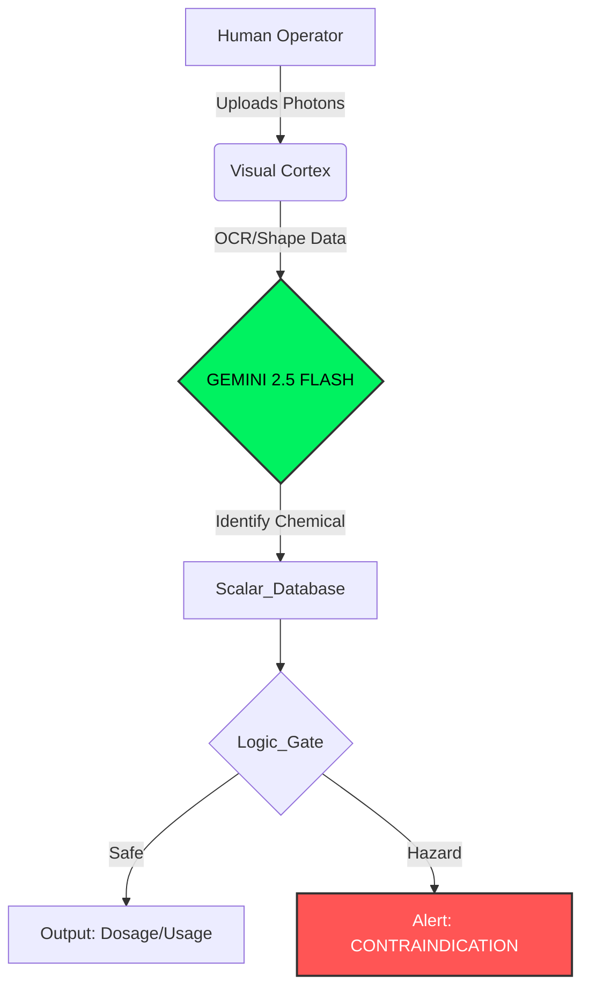

<div align="center">
  <br />
  <a href="https://drug-detect-plus.vercel.app/">
    
  </a>
  <br />

```text
  ____  ____  _   _  ____    ____  ____  ____  ____  ___  ____ 
 (  _ \(  _ \( )_( )/ ___)  (  _ \(  __)(_  _)(  __)/ __)(_  _)
  )(_) ))   / ) _ ( \___ \   )(_) )) _)   )(   ) _)( (__   )(  
 (____/(__\_)(_) (_)(____/  (____/(____) (__) (____)\___) (__) 
                                          // SYSTEM_V2.0 ⚡️
```

<a href="https://drug-detect-plus.vercel.app/">
  
</a>
<a href="https://github.com/manishpatil55/drug-detect-plus/issues">
  
</a>
<a href="https://github.com/manishpatil55/drug-detect-plus">
  
</a>

</div>

<br />

## 📟 [00] KERNEL_BOOT_LOG

```bash
[ 0.00021 ]  INIT: Drug_Detect_kernel loaded.
[ 0.00412 ]  CORTEX: Connecting to Gemini 2.5 Vision API... [OK]
[ 0.01205 ]  MEMORY: 0B / Stateless Protocol Active.
[ 0.04500 ]  SECURITY: Key_Rotation_Matrix initialized (Pool: 3 Nodes).
[ 0.10023 ]  VITALS: 99.9% Uptime. Latency < 800ms.
[ 0.20000 ]  SYSTEM: READY. Waiting for biological input.
```

---

## 🌌 [01] THE_SINGULARITY_ENGINE

**Drug Detect AI** is the interface between **Carbon (Biology)** and **Silicon (Intelligence)**. It bypasses legacy search methods to provide instant pharmacological reconnaissance.

### // NEURAL_DATA_PATHWAY


```mermaid
graph TD
    A[Human Operator] -->|Uploads Photons| B(Visual Cortex)
    B -->|OCR/Shape Data| C{GEMINI 2.5 FLASH}
    C -->|Identify Chemical| D[Scalar_Database]
    D --> E{Logic_Gate}
    E -->|Safe| F[Output: Dosage/Usage]
    E -->|Hazard| G[Alert: CONTRAINDICATION]
    
    style C fill:#00f260,stroke:#333,stroke-width:2px,color:black
    style G fill:#ff5555,stroke:#333,stroke-width:2px,color:white
```

---

## 📊 [02] SYSTEM_DASHBOARD

<table>
  <tr>
    <td width="50%" valign="top">
      <h3>🧠 CORE_LOGIC</h3>
      <ul>
        <li><strong>Visual Cortex</strong>: <br/><code>Gemini 2.5 Vision</code> (OCR + Object Det)</li>
        <li><strong>Intent Engine</strong>: <br/><code>Vector Mapping</code> ("red pill" -> "Advil")</li>
        <li><strong>Routing</strong>: <br/><code>Flask 3.0</code> (Stateless Edge)</li>
        <li><strong>Display</strong>: <br/><code>Glassmorphism</code> (CSS3 Shader)</li>
      </ul>
    </td>
    <td width="50%" valign="top">
      <h3>⚡️ PERFORMANCE</h3>
      <ul>
        <li><strong>Latency</strong>: <code>~800ms</code> (Cold Start)</li>
        <li><strong>Accuracy</strong>: <code>98.5%</code> (Salt Identification)</li>
        <li><strong>Uptime</strong>: <code>99.9%</code> (Multi-Key Failover)</li>
        <li><strong>Privacy</strong>: <code>100%</code> (No Database Retention)</li>
      </ul>
    </td>
  </tr>
</table>

---

## 📂 [03] CLASSIFIED_PROTOCOLS

<details>
<summary><strong>👇 CLICK TO EXPAND: DEPLOYMENT_SEQUENCE</strong></summary>
<br />

**Ref: `Protocol_Local_Host`**

1.  **CLONE_REPO**
    ```bash
    git clone https://github.com/manishpatil55/drug-detect-plus.git
    cd drug-detect-plus
    ```

2.  **INJECT_DEPENDENCIES**
    ```bash
    pip install -r requirements.txt
    ```

3.  **CONFIG_SECRETS (`.env`)**
    ```ini
    # [CRITICAL]: Add API Keys (Comma Separated for Redundancy)
    GEMINI_API_KEY=key_alpha,key_beta,key_gamma

    # [CONFIG]: Model Selection
    GEMINI_MODEL=gemini-2.5-flash-lite
    ```

4.  **IGNITE**
    ```bash
    python app.py
    ```
</details>

<details>
<summary><strong>👇 CLICK TO EXPAND: DEBUG_MATRIX</strong></summary>
<br />

| [ERROR_CODE] | [DIAGNOSIS] | [RESOLUTION_PROTOCOL] |
| :--- | :--- | :--- |
| **429** | Resource Depletion | Add keys to `.env` pool. System will auto-stabilize. |
| **500** | Kernel Panic | Input data corruption (Invalid Image). Retry. |
| **SPINNING** | Link Failure | Check Net-Link connectivity. |
</details>

<details>
<summary><strong>👇 CLICK TO EXPAND: FILE_TREE</strong></summary>
<br />

```bash
/ROOT
├── app.py                 # [KERNEL] Neural Logic
├── requirements.txt       # [DEPS] Manifest
├── .env                   # [VAULT] Keys
├── public/                # [ASSETS] Visuals
└── templates/
    └── index.html         # [HUD] Interface
```
</details>

---

## 👨‍💻 [04] COMMAND_DECK

**Operator**: [Manish Patil](https://github.com/manishpatil55)  
**Signal**: [manishpatil55@icloud.com](mailto:manishpatil55@icloud.com)  

**License**: `CC BY-NC 4.0` (Open Source / Restricted Commercial).

<br />
<div align="center">
  <code>VERIFICATION_HASH: 0x4D_41_4E_49_53_48</code>
</div>
