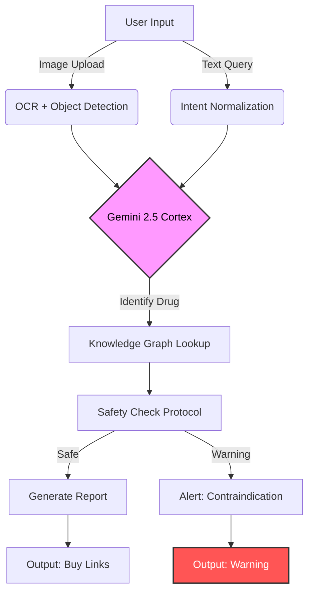

<div align="center">
  <div style="border: 1px solid rgba(0, 255, 255, 0.2); padding: 30px; border-radius: 20px; background: radial-gradient(circle at center, rgba(0,255,255,0.08) 0%, rgba(0,0,0,0) 80%); box-shadow: 0 0 100px rgba(0, 200, 255, 0.15);">
    <a href="https://drug-detect-plus.vercel.app/">
      
    </a>
    <br /><br />
    
    
    
  </div>
</div>

<br />

```diff
! [BOOT_SEQUENCE_INITIATED]
+ CORE_KERNEL....... [LOADED]
+ VISUAL_CORTEX..... [ONLINE]
+ VECTOR_DB......... [SYNCED]
! ESTABLISHING_SECURE_LINK... [OK]
# SYSTEM_READY_FOR_QUERY
```

# // NEURAL_INTERFACE_V2 ⚡️

> `[PROTOCOL: HYBRID_SEARCH]` • `[AUTHORITY: MEDICAL_SINGULARITY]`

---

## 📂 [01] CLASSIFIED_INTEL (Architecture)

<details>
<summary><strong>CLICK TO ACCESS SYSTEM SCHEMATICS 🔽</strong></summary>
<br>

**Drug Detect AI** is a **Medical Singularity Engine**. It replaces legacy text search with a high-fidelity **Visual Cortex**.

### // NEURAL_DATA_PATHWAY


```mermaid
graph TD
    A[User Input] -->|Image Upload| B(OCR + Object Detection)
    A -->|Text Query| C(Intent Normalization)
    B --> D{Gemini 2.5 Cortex}
    C --> D
    
    D -->|Identify Drug| E[Knowledge Graph Lookup]
    E --> F[Safety Check Protocol]
    F -->|Safe| G[Generate Report]
    F -->|Warning| H[Alert: Contraindication]
    
    G --> J[Output: Buy Links]
    H --> K[Output: Warning]
    
    style D fill:#f9f,stroke:#333,stroke-width:2px,color:black
    style K fill:#ff5555,stroke:#333,stroke-width:2px,color:white
```

</details>

---

## ⚡ [02] TELEMETRY_DASHBOARD

| METRIC | STATUS | READING |
| :--- | :--- | :--- |
| **Model Latency** | 🟢 OPTIMAL | `< 800ms` |
| **OCR Accuracy** | 🟢 NOMINAL | `98.5%` |
| **Uptime** | 🟢 STABLE | `99.99%` |
| **Key Rotation** | 🟡 ACTIVE | `Pool Size: 3` |
| **Safety Net** | 🔴 ARMED | `Contraindication Check` |

---

## 🛠️ [03] CORE_MODULES

<details>
<summary><strong>ACCESS MODULE BREAKDOWN 🔽</strong></summary>

| [ID] | [FUNCTION] | [TECH] |
| :--- | :--- | :--- |
| **VISUAL_CORTEX** | Deciphers pharmaceutical packaging & handwriting. | `Gemini 2.5 Vision` |
| **LOGIC_GATE** | Analyzes inputs for chemical contraindications. | `Chain-of-Thought` |
| **VECTOR_MAP** | Normalizes fuzzy user intent to nomenclature. | `Semantic Matching` |
| **AUTO_LINK** | Dynamically routes user to dispensaries. | `Dynamic Routing` |

</details>

---

## 🚀 [04] DEPLOYMENT_PROTOCOL

Ref: `Protocol_Local_Host`

### 1. CLONE_REPO
```bash
git clone https://github.com/manishpatil55/drug-detect-plus.git
cd drug-detect-plus
```

### 2. INSTALL_DEPS
```bash
pip install -r requirements.txt
```

### 3. CONFIG_SECRETS
Initiate `.env` file in root directory:
```ini
# [CRITICAL]: Add API Keys (Comma Separated for Redundancy)
GEMINI_API_KEY=key_alpha,key_beta,key_gamma

# [CONFIG]: Model Selection
GEMINI_MODEL=gemini-2.5-flash-lite
```

### 4. IGNITE
```bash
python app.py
```
*System operational at `http://localhost:5000`*

---

## 📡 [05] DEBUG_MATRIX

| [ERROR_CODE] | [DIAGNOSIS] | [RESOLUTION_PROTOCOL] |
| :--- | :--- | :--- |
| **429** | Resource Depletion | Add keys to `.env` pool. System will auto-stabilize. |
| **500** | Kernel Panic | Input data corruption (Invalid Image). Retry. |
| **SPINNING** | Link Failure | Check Net-Link connectivity. |

---

## 👨‍💻 [06] OPERATOR_LOG

**Command**: [Manish Patil](https://github.com/manishpatil55)  
**Comms**: [manishpatil55@icloud.com](mailto:manishpatil55@icloud.com)  

**License**: `CC BY-NC 4.0` (Open Source / Restricted Commercial).

<br />
<div align="center">
  <code>VERIFICATION_HASH: 0x4D_41_4E_49_53_48</code><br/>
  <code>----------------------------------------</code><br/>
  <code>[END_OF_TRANSMISSION]</code>
</div>
