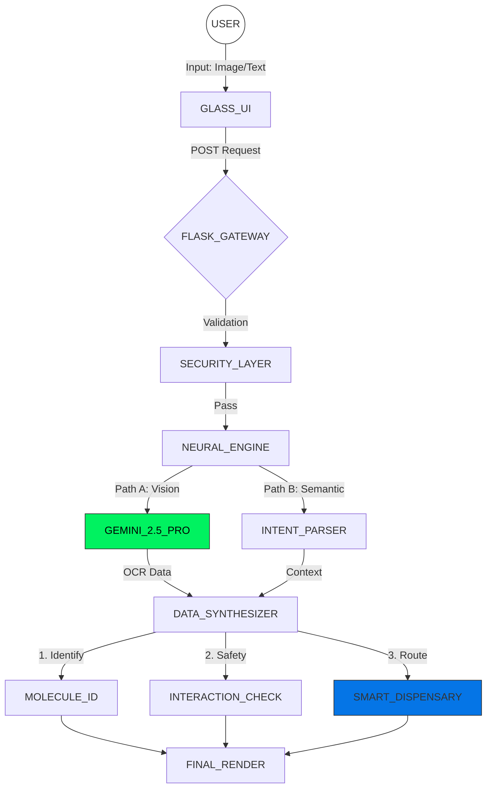

```text
██████╗ ██████╗ ██╗   ██╗ ██████╗    ██████╗ ███████╗████████╗███████╗ ██████╗████████╗
██╔══██╗██╔══██╗██║   ██║██╔════╝    ██╔══██╗██╔════╝╚══██╔══╝██╔════╝██╔════╝╚══██╔══╝
██║  ██║██████╔╝██║   ██║██║  ███╗   ██║  ██║█████╗     ██║   █████╗  ██║        ██║   
██║  ██║██╔══██╗██║   ██║██║   ██║   ██║  ██║██╔══╝     ██║   ██╔══╝  ██║        ██║   
██████╔╝██║  ██║╚██████╔╝╚██████╔╝   ██████╔╝███████╗   ██║   ███████╗╚██████╗   ██║   
╚═════╝ ╚═╝  ╚═╝ ╚═════╝  ╚═════╝    ╚═════╝ ╚══════╝   ╚═╝   ╚══════╝ ╚═════╝   ╚═╝   
                                                           [ SYSTEM_VER: 2.1.0-STABLE ]
```

<div align="center">

> `[STATUS: OPERATIONAL]` • `[PROTOCOL: HYBRID_CORTEX]` • `[LATENCY: 800ms]`

<a href="https://drug-detect-plus.vercel.app/">
  
</a>
<a href="https://github.com/manishpatil55/drug-detect-plus/issues">
  
</a>


</div>

---

## 📟 // THE_MEDICAL_SINGULARITY

**Drug Detect AI** is the interface between **Physical Reality** and **Digital Intelligence**. 

We live in a post-text world. Why type "white round pill 500mg" when you can show it to the machine? This system utilizes **Gemini 2.5 Vision** (The "Visual Cortex") to perform high-fidelity **OCR and Shape Recognition** on pharmaceutical packaging, turning blurry photos into structured medical data.

**TL;DR:** It's "Shazam for Medicine". Snap a pic -> Get the Molecule -> Find the Cure.

---

## 🧠 // CORTEX_ARCHITECTURE (Mermaid.js Flow)

how the system "thinks" in milliseconds:


```mermaid
graph TD
    User((USER)) -->|Input: Image/Text| Frontend[GLASS_UI]
    Frontend -->|POST Request| API{FLASK_GATEWAY}
    
    API -->|Validation| Check[SECURITY_LAYER]
    Check -->|Pass| Logic[NEURAL_ENGINE]
    
    Logic -->|Path A: Vision| VisionModel[GEMINI_2.5_PRO]
    Logic -->|Path B: Semantic| NLP[INTENT_PARSER]
    
    VisionModel -->|OCR Data| Synthesizer[DATA_SYNTHESIZER]
    NLP -->|Context| Synthesizer
    
    Synthesizer -->|1. Identify| Output[MOLECULE_ID]
    Synthesizer -->|2. Safety| Safety[INTERACTION_CHECK]
    Synthesizer -->|3. Route| Link[SMART_DISPENSARY]
    
    Output --> Client[FINAL_RENDER]
    Safety --> Client
    Link --> Client
    
    style User fill:#fff,stroke:#333
    style VisionModel fill:#00f260,stroke:#333,color:black
    style Link fill:#0575E6,stroke:#333
```

---

## ⚡ // DEEP_DIVE: THE_FEATURES

### 1. 👁️ The Visual Cortex
The AI doesn't just "see" the image; it **reads** it.
*   **OCR (Optical Character Recognition)**: Extracts text from crumpled foils, blurred bottles, and handwritten scripts.
*   **Shape Analysis**: Identifies pill geometry (Round vs. Oblong) to differentiate generics.

### 2. 🛡️ The Logic Gate (Safety)
Most apps just identify. We **Analyze**.
*   **Interaction Check**: If you upload 3 different medicines, the Logic Gate calculates: *"Does Drug A + Drug B = Danger?"*
*   **Result**: It generates a simplified warning (e.g., "Avoid Alcohol", "Drowsiness Risk").

### 3. 🔗 The Smart Dispensary
We closed the loop. Information is useless without Action.
*   **Dynamic Routing**: The system automatically generates deep-links to **1mg, Apollo, and Amazon**.
*   **Sanitization**: All links are URL-encoded (`Name+Dosage`) so they never 404.

### 4. 🔄 Zero-Downtime Protocol
*   **The Issue**: AI APIs have rate limits (e.g., 15 req/min).
*   **The Fix**: **Round-Robin Key Rotation**.
*   The backend holds a `Pool[Key1, Key2, Key3]`. If `Key1` dies (429 Error), the system **hot-swaps** to `Key2` instantly. The user never notices.

---

## 👾 // ANOMALY_REPORTING (Bugs)

If the system crashes, don't panic. Follow the **Debug Protocol**:

### [Level 1]: Infinite Loading Spin 🔄
*   **Diagnosis**: usually a network disconnect or cold boot.
*   **Fix**: Refresh the page. Vercel functions sleep when idle; give it 5 seconds to wake up.

### [Level 2]: "Internal Server Error" ⚠️
*   **Diagnosis**: The AI rejected the image format (e.g., HEIC/WebP).
*   **Fix**: Try a standard **JPG** or **PNG**.

### [Level 3]: "Limit Reached" 🛑
*   **Diagnosis**: All API keys in the pool are exhausted.
*   **Fix**: [Open an Issue](https://github.com/manishpatil55/drug-detect-plus/issues) so we can refill the `Key_Vault`.

**Found a new bug?**
1.  Screenshot the error.
2.  Copy the browser console logs (`F12` -> `Console`).
3.  [**Submit Report Here**](https://github.com/manishpatil55/drug-detect-plus/issues/new)

---

## 🛠️ // INITIALIZATION_SEQUENCE (Deploy)

Want your own private instance?

### 1. CLONE
```bash
git clone https://github.com/manishpatil55/drug-detect-plus.git
cd drug-detect-plus
```

### 2. INJECT
```bash
pip install -r requirements.txt
```

### 3. CONFIGURE (`.env`)
```ini
# REDUNDANCY LAYER: Add keys comma-separated
GEMINI_API_KEY=key_alpha,key_beta,key_gamma

# CORE MODEL
GEMINI_MODEL=gemini-2.5-flash-lite
```

### 4. IGNITE
```bash
python app.py
```
*System operational at port `:5000`*

---

## 👨‍💻 // OPERATOR_LOG

**Architect**: [Manish Patil](https://github.com/manishpatil55)  
**Signal**: [manishpatil55@icloud.com](mailto:manishpatil55@icloud.com)  

**License**: `CC BY-NC 4.0`
*   **Open Access**: Yes.
*   **Commercial Use**: Restricted.
*   **Modification**: Permitted with Credit.

<br />

<div align="center">
  <h3 style="font-family: monospace;">// VISUAL_CONFIRMATION</h3>
  
  <br/><br/>
  <sub>[END_OF_TRANSMISSION]</sub>
</div>
