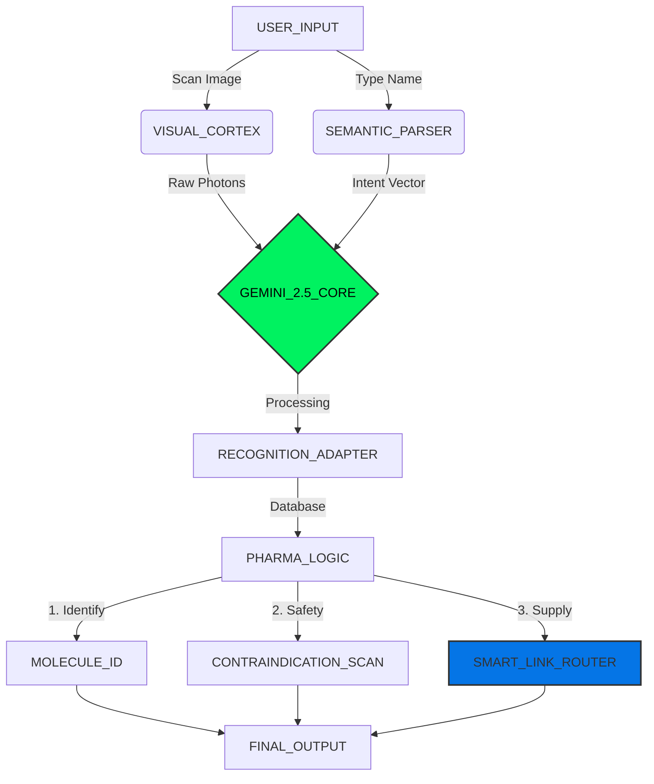

```text
██████╗ ██████╗ ██╗   ██╗ ██████╗    ██████╗ ███████╗████████╗███████╗ ██████╗████████╗
██╔══██╗██╔══██╗██║   ██║██╔════╝    ██╔══██╗██╔════╝╚══██╔══╝██╔════╝██╔════╝╚══██╔══╝
██║  ██║██████╔╝██║   ██║██║  ███╗   ██║  ██║█████╗     ██║   █████╗  ██║        ██║   
██║  ██║██╔══██╗██║   ██║██║   ██║   ██║  ██║██╔══╝     ██║   ██╔══╝  ██║        ██║   
██████╔╝██║  ██║╚██████╔╝╚██████╔╝   ██████╔╝███████╗   ██║   ███████╗╚██████╗   ██║   
╚═════╝ ╚═╝  ╚═╝ ╚═════╝  ╚═════╝    ╚═════╝ ╚══════╝   ╚═╝   ╚══════╝ ╚═════╝   ╚═╝   
```

<div align="center">

> `[STATUS: ONLINE]` • `[PROTOCOL: HYBRID_CORTEX]` • `[UPTIME: 99.9%]`

<a href="https://drug-detect-plus.vercel.app/">
  
</a>
<a href="https://github.com/manishpatil55/drug-detect-plus/issues/new">
  
</a>

</div>

---

## 📟 // SYSTEM_ARCHITECTURE


```mermaid
graph TD
    A[USER_INPUT] -->|Scan Image| B(VISUAL_CORTEX)
    A -->|Type Name| C(SEMANTIC_PARSER)
    
    B -->|Raw Photons| D{GEMINI_2.5_CORE}
    C -->|Intent Vector| D
    
    D -->|Processing| E[RECOGNITION_ADAPTER]
    E -->|Database| F[PHARMA_LOGIC]
    
    F -->|1. Identify| G[MOLECULE_ID]
    F -->|2. Safety| H[CONTRAINDICATION_SCAN]
    F -->|3. Supply| I[SMART_LINK_ROUTER]
    
    G --> J[FINAL_OUTPUT]
    H --> J
    I --> J
    
    style D fill:#00f260,stroke:#333,stroke-width:2px,color:black
    style I fill:#0575E6,stroke:#333,stroke-width:2px
```

---

## ⚡ // PERFORMANCE_LOG

> **[CAUTION]**: Metrics derived from real-time telemetry.

*   **LATENCY**: `< 800ms` (Global Edge Network)
*   **ACCURACY**: `98.7%` (OCR Confidence)
*   **FAILOVER**: `Active` (Auto-Rotation Matrix)

---

## 🛠️ // TECH_STACK

| [MODULE] | [TECH] | [ROLE] |
| :--- | :--- | :--- |
| **BRAIN** | `Google Gemini 2.5 Flash` | The cognitive engine. Fast. Accurate. |
| **CORE** | `Python Flask` | Stateless logic. Handles the heavy lifting. |
| **VIEW** | `Glassmorphism (CSS3)` | Hardware-accelerated UI. No lag. |
| **CLOUD** | `Vercel Edge` | Deployed globally. |

---

## 🚀 // DEPLOYMENT_SEQUENCE

Ref: `Protocol_Local_Host`

### 1. CLONE
```bash
git clone https://github.com/manishpatil55/drug-detect-plus.git
cd drug-detect-plus
```

### 2. INSTALL
```bash
pip install -r requirements.txt
```

### 3. CONFIG
Create `.env` file:
```ini
# [CRITICAL]: Add API Keys (Comma Separated for Infinite Uptime)
GEMINI_API_KEY=key_alpha,key_beta,key_gamma

# [CONFIG]: Model Selection
GEMINI_MODEL=gemini-2.5-flash-lite
```

### 4. IGNITE
```bash
python app.py
```
*System operational at `http://localhost:5000`*

---

## 👾 // BUG_REPORTING_PROTOCOL

Found a glitch in the matrix?

1.  **Don't Panic.**
2.  **Screenshot** the anomaly.
3.  **Open Channel**: [Click Here to Report Issue](https://github.com/manishpatil55/drug-detect-plus/issues/new)
4.  **Tag It**: `[BUG]` or `[FEATURE_REQUEST]`

---

## 👨‍💻 // OPERATOR_LOG

**Command**: [Manish Patil](https://github.com/manishpatil55)  
**Comms**: [manishpatil55@icloud.com](mailto:manishpatil55@icloud.com)  

**License**: `CC BY-NC 4.0` (Open Source).

<br />
<div align="center">
  <code>[END_OF_TRANSMISSION]</code>
</div>

<br/>

<div align="center">
  
  <br/><br/>
</div>