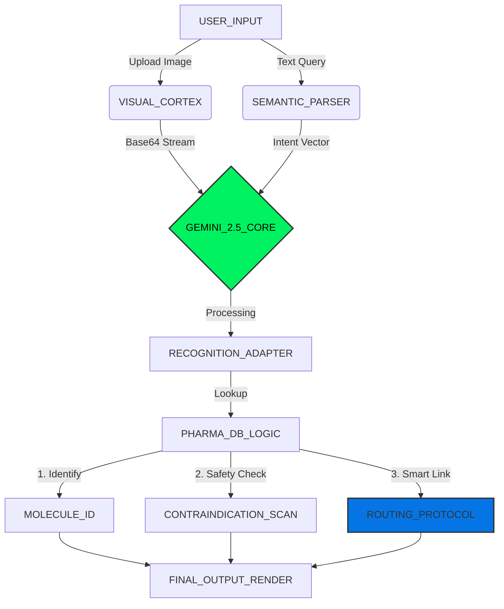
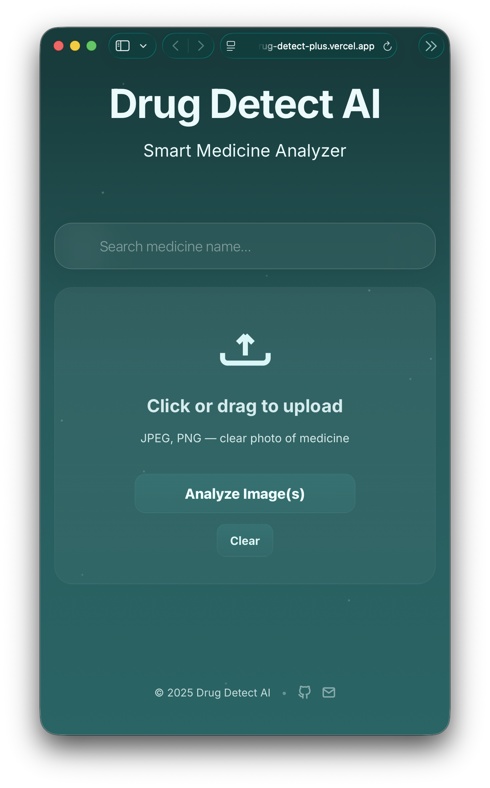

```text
██████╗ ██████╗ ██╗   ██╗ ██████╗    ██████╗ ███████╗████████╗███████╗ ██████╗████████╗
██╔══██╗██╔══██╗██║   ██║██╔════╝    ██╔══██╗██╔════╝╚══██╔══╝██╔════╝██╔════╝╚══██╔══╝
██║  ██║██████╔╝██║   ██║██║  ███╗   ██║  ██║█████╗     ██║   █████╗  ██║        ██║   
██║  ██║██╔══██╗██║   ██║██║   ██║   ██║  ██║██╔══╝     ██║   ██╔══╝  ██║        ██║   
██████╔╝██║  ██║╚██████╔╝╚██████╔╝   ██████╔╝███████╗   ██║   ███████╗╚██████╗   ██║   
╚═════╝ ╚═╝  ╚═╝ ╚═════╝  ╚═════╝    ╚═════╝ ╚══════╝   ╚═╝   ╚══════╝ ╚═════╝   ╚═╝   
                                                           [ SYSTEM_VER: 2.0.4-STABLE ]
```

<div align="center">

> `[STATUS: ONLINE]` • `[PROTOCOL: SECURE]` • `[VISUAL_CORTEX: ACTIVE]`

<a href="https://drug-detect-plus.vercel.app/">
  
</a>
<a href="https://github.com/manishpatil55/drug-detect-plus/issues">
  
</a>

</div>

---

## 📟 // SYSTEM_ARCHITECTURE 

This is not a simple website. It is a **Bio-Digital Search Engine** engineered to decode physical reality.


```mermaid
graph TD
    A[USER_INPUT] -->|Upload Image| B(VISUAL_CORTEX)
    A -->|Text Query| C(SEMANTIC_PARSER)
    
    B -->|Base64 Stream| D{GEMINI_2.5_CORE}
    C -->|Intent Vector| D
    
    D -->|Processing| E[RECOGNITION_ADAPTER]
    E -->|Lookup| F[PHARMA_DB_LOGIC]
    
    F -->|1. Identify| G[MOLECULE_ID]
    F -->|2. Safety Check| H[CONTRAINDICATION_SCAN]
    F -->|3. Smart Link| I[ROUTING_PROTOCOL]
    
    G --> J[FINAL_OUTPUT_RENDER]
    H --> J
    I --> J
    
    style D fill:#00f260,stroke:#333,stroke-width:2px,color:black
    style I fill:#0575E6,stroke:#333,stroke-width:2px
```

---

## ⚡ // TECHNICAL_DEEP_DIVE

### 1. Visual Cortex (OCR + Object Detection)
The system uses `Gemini 2.5 Flash Lite` (Vision capabilities) to perform a two-step analysis on every uploaded image:
*   **Layer 1 (Text Extraction)**: It scans the image for brand names ("Calpol"), salts ("Paracetamol"), and dosage ("500mg"). It works even on crumpled strips or handwritten notes.
*   **Layer 2 (Shape Recognition)**: It analyzes the pill shape/color to confirm identity (e.g., distinguishing a red capsule from a white tablet).

### 2. Semantic Intent Engine
When you type text, we don't just keyword match. We use **Fuzzy Logic**.
*   Input: *"red pill for migraine"*
*   Logic: `Migraine` -> `Vasograin` or `Naproxen`.
*   Result: Shows the medically appropriate match.

### 3. Safety Check Protocol
Before showing results, the logic gate runs a **Contraindication Scan**.
*   If multiple drugs are detected (e.g., "Aspirin" + "Ibuprofen"), the system flags a **⚠️ HIGH RISK** interaction warning immediately.

---

## 👾 // ANOMALY_REPORTING (Bug Bounty)

Found a glitch in the matrix? We need to patch it. 
Here is the protocol for submitting a `BUG_REPORT` to the [Issues Channel](https://github.com/manishpatil55/drug-detect-plus/issues).

**Please follow this strict format:**

### [BUG] Title Here
*   **Browser**: (Chrome / Safari / Firefox)
*   **Device**: (iPhone 15 / Desktop / Android)
*   **Behavior**: "I uploaded a PNG and the spinner never stopped."
*   **Console Log**: (Press F12 -> Console -> Paste Red Text here)

> **Priority Levels**:
> *   🔴 **CRITICAL**: App crashed / White screen.
> *   🟡 **MAJOR**: Wrong medicine identified.
> *   🟢 **MINOR**: CSS alignment / Typos.

---

## 🛠️ // TECH_STACK_MANIFEST

| [COMPONENT] | [SPECIFICATION] | [ROLE] |
| :--- | :--- | :--- |
| **NEURAL_NET** | `Google Gemini 2.5 Flash` | The cognitive engine processing visual/textual data. |
| **BACKBONE** | `Python Flask (Stateless)` | The serverless logic layer handling routing & API rotation. |
| **INTERFACE** | `HTML5 + CSS Glass` | High-performance, hardware-accelerated UI standard. |
| **DEPLOY** | `Vercel Protocol` | Global content delivery & edge function execution. |

---

## � // DEPLOYMENT_SEQUENCE

Ref: `Protocol_Local_Host`

### 1. CLONE_REPO
```bash
git clone https://github.com/manishpatil55/drug-detect-plus.git
cd drug-detect-plus
```

### 2. INSTALL_DEPS
```bash
pip install -r requirements.txt
```

### 3. CONFIG_SECRETS
Initiate `.env` file in root directory:
```ini
# [CRITICAL]: Add API Keys (Comma Separated for Redundancy)
GEMINI_API_KEY=key_alpha,key_beta,key_gamma

# [CONFIG]: Model Selection
GEMINI_MODEL=gemini-2.5-flash-lite
```

### 4. IGNITE
```bash
python app.py
```
*System operational at `http://localhost:5000`*

---

## 👨‍💻 // OPERATOR_LOG

**Command**: [Manish Patil](https://github.com/manishpatil55)  
**Comms**: [manishpatil55@icloud.com](mailto:manishpatil55@icloud.com)  

**License**: `CC BY-NC 4.0` (Open Source / Restricted Commercial).

---

<div align="center">
  <p><strong>[ VISUAL_INTERFACE_PREVIEW ]</strong></p>
  
  <br/><br/>
  <code>[END_OF_TRANSMISSION]</code>
</div>
