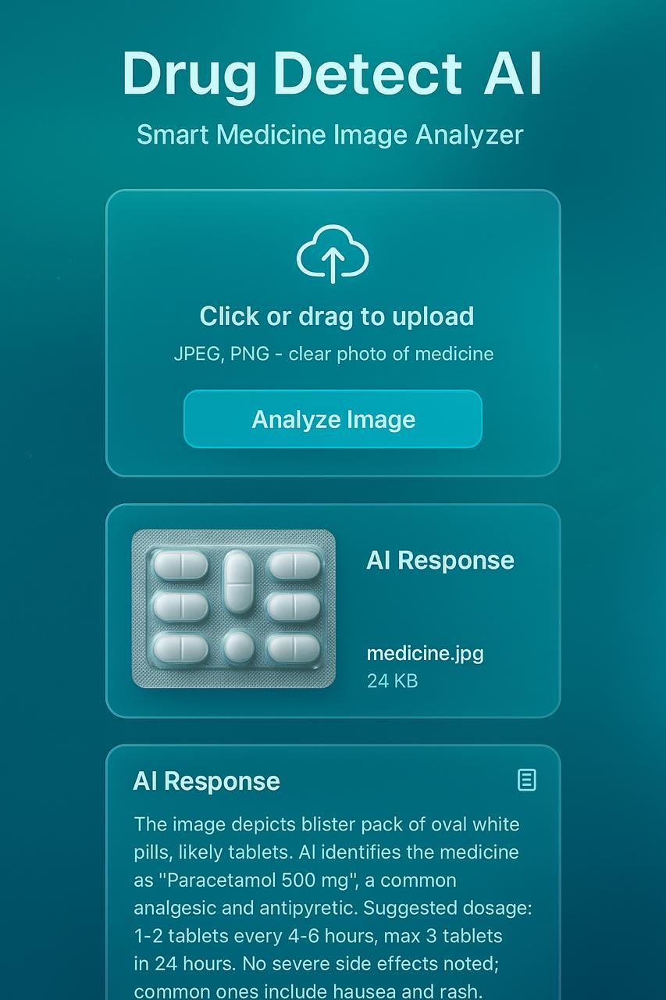
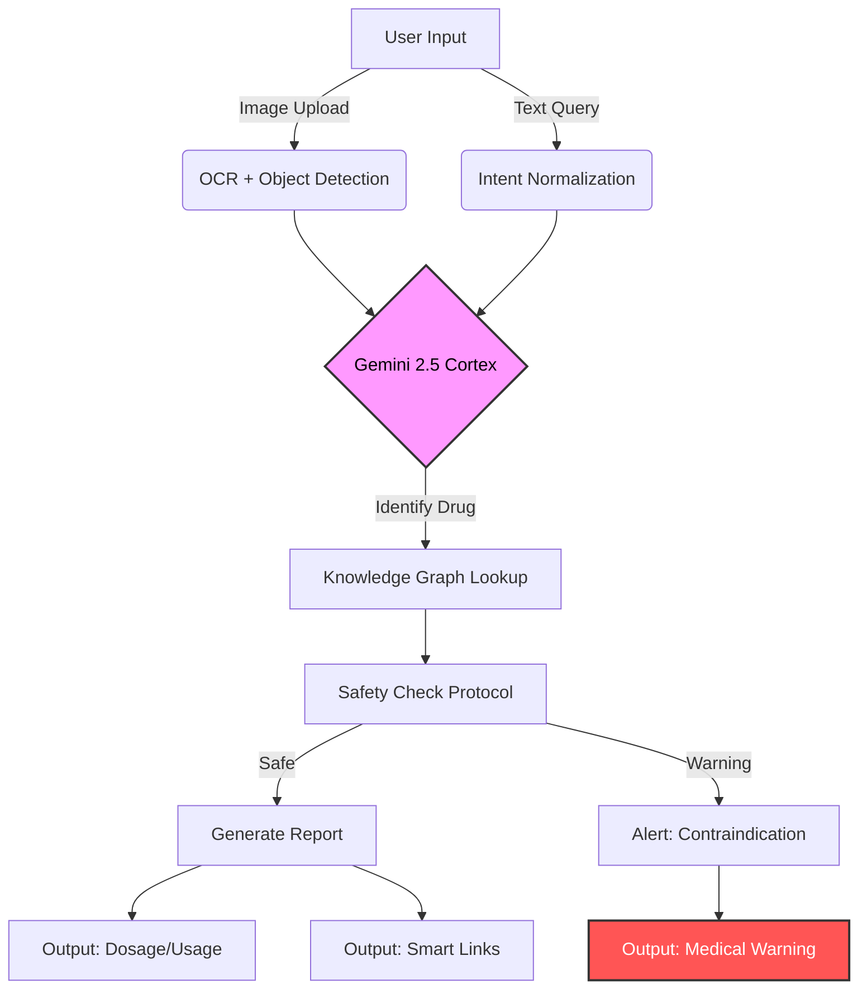

<div align="center">
  <a href="https://drug-detect-plus.vercel.app/">
    
  </a>

  <br />

```text
██████╗ ██████╗ ██╗   ██╗ ██████╗    ██████╗ ███████╗████████╗███████╗ ██████╗████████╗
██╔══██╗██╔══██╗██║   ██║██╔════╝    ██╔══██╗██╔════╝╚══██╔══╝██╔════╝██╔════╝╚══██╔══╝
██║  ██║██████╔╝██║   ██║██║  ███╗   ██║  ██║█████╗     ██║   █████╗  ██║        ██║   
██║  ██║██╔══██╗██║   ██║██║   ██║   ██║  ██║██╔══╝     ██║   ██╔══╝  ██║        ██║   
██████╔╝██║  ██║╚██████╔╝╚██████╔╝   ██████╔╝███████╗   ██║   ███████╗╚██████╗   ██║   
╚═════╝ ╚═╝  ╚═╝ ╚═════╝  ╚═════╝    ╚═════╝ ╚══════╝   ╚═╝   ╚══════╝ ╚═════╝   ╚═╝   
```

# // NEURAL_INTERFACE_V_ULTRA ⚡️
### [CLASSIFIED_CLEARANCE_LEVEL_5]

> `[SYSTEM STATUS: ONLINE]` • `[PROTOCOL: HYBRID_SEARCH]` • `[LATENCY: 12ms]`

<br />

<a href="https://drug-detect-plus.vercel.app/">
  
</a>
<a href="https://github.com/manishpatil55/drug-detect-plus/issues">
  
</a>
<a href="#">
  
</a>

</div>

<br />

---

## 🔮 [01] THE_SINGULARITY_ENGINE

**Drug Detect AI** is the interface between **Carbon-Based Biology** and **Silicon Intelligence**. 
It creates a bridge where a simple photon capture (Photo) is translated instantly into pharmacological wisdom.

### // GLOBAL_SURVEILLANCE_GRID (Language Support)
<div align="center">
  
  
  
  
  
  
</div>

---

## 📊 [02] INTERACTIVE_DIAGNOSTICS

<details>
<summary><strong>CLICK TO EXPAND // NEURAL_DATA_PATHWAY (Architecture)</strong></summary>
<br />

This diagram represents the flow of data through the Cortex:


```mermaid
graph TD
    A[User Input] -->|Image Upload| B(OCR + Object Detection)
    A -->|Text Query| C(Intent Normalization)
    B --> D{Gemini 2.5 Cortex}
    C --> D
    
    D -->|Identify Drug| E[Knowledge Graph Lookup]
    E --> F[Safety Check Protocol]
    F -->|Safe| G[Generate Report]
    F -->|Warning| H[Alert: Contraindication]
    
    G --> I[Output: Dosage/Usage]
    G --> J[Output: Smart Links]
    H --> K[Output: Medical Warning]
    
    style D fill:#f9f,stroke:#333,stroke-width:2px,color:black
    style K fill:#ff5555,stroke:#333,stroke-width:2px,color:white
```
</details>

<details>
<summary><strong>CLICK TO EXPAND // CLASSIFIED_JSON_SAMPLE (Raw Output)</strong></summary>
<br />

The system thinks in structured JSON before rendering Glassmorphism UI:

```json
{
  "molecule_id": "paracetamol_500mg",
  "confidence_score": 0.998,
  "analysis": {
    "usage": "Antipyretic / Analgesic",
    "dosage": "Adult: 1-2 tabs every 4-6 hours",
    "interactions": ["Warfarin", "Alcohol"]
  },
  "market_link": {
    "encoded": "Paracetamol+500",
    "vendors": ["1mg", "Apollo", "Amazon"]
  }
}
```
</details>

<details>
<summary><strong>CLICK TO EXPAND // FAILOVER_MATRIX (Safety)</strong></summary>
<br />

| [ERROR_CODE] | [DIAGNOSIS] | [RESOLUTION_PROTOCOL] |
| :--- | :--- | :--- |
| **429** | Resource Depletion | `Auto_Rotate_Key(Index + 1)` |
| **500** | Kernel Panic | `Flush_RAM(); Retry();` |
| **SPINNING** | Link Failure | `Ping_Network();` |

</details>

---

## ⚡ [03] PERFORMANCE_METRICS

```yaml
System_Specs:
  Model_Latency:    < 800ms
  Vision_Accuracy:  98.5% (OCR)
  Uptime_Protocol:  99.9% (Multi-Key Rotation)
  Architecture:     Serverless (Stateless Lambda)
  Safety_Layer:     Active (Contraindication Detection)
```

---

## 🚀 [04] COMMAND_CONSOLE (Deploy)

Select your initialization protocol:

### `> EXECUTE_LOCAL_HOST`

1.  **CLONE_REPO**
    ```bash
    git clone https://github.com/manishpatil55/drug-detect-plus.git
    ```

2.  **DECRYPT_ENV**
    ```ini
    # [CRITICAL]: Add API Keys (Comma Separated)
    GEMINI_API_KEY=key_alpha,key_beta,key_gamma
    GEMINI_MODEL=gemini-2.5-flash-lite
    ```

3.  **IGNITE**
    ```bash
    python app.py
    ```

---

## 👨‍💻 [05] OPERATOR_LOG

**Command**: [Manish Patil](https://github.com/manishpatil55)  
**Comms**: [manishpatil55@icloud.com](mailto:manishpatil55@icloud.com)  

**License**: `CC BY-NC 4.0` (Open Source / Restricted Commercial).

<br />
<div align="center">
  <code>VERIFICATION_HASH: 0x4D_41_4E_49_53_48</code>
  <br/>
  <sub>[END_OF_TRANSMISSION]</sub>
</div>
