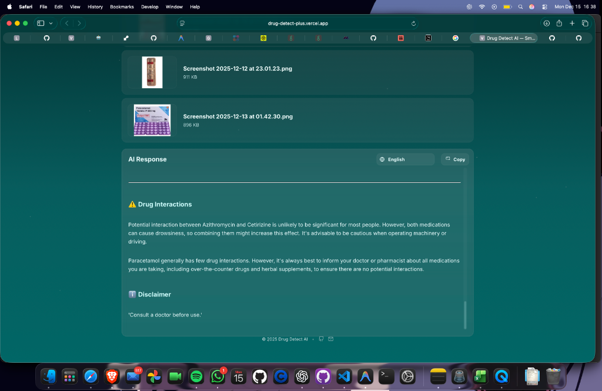
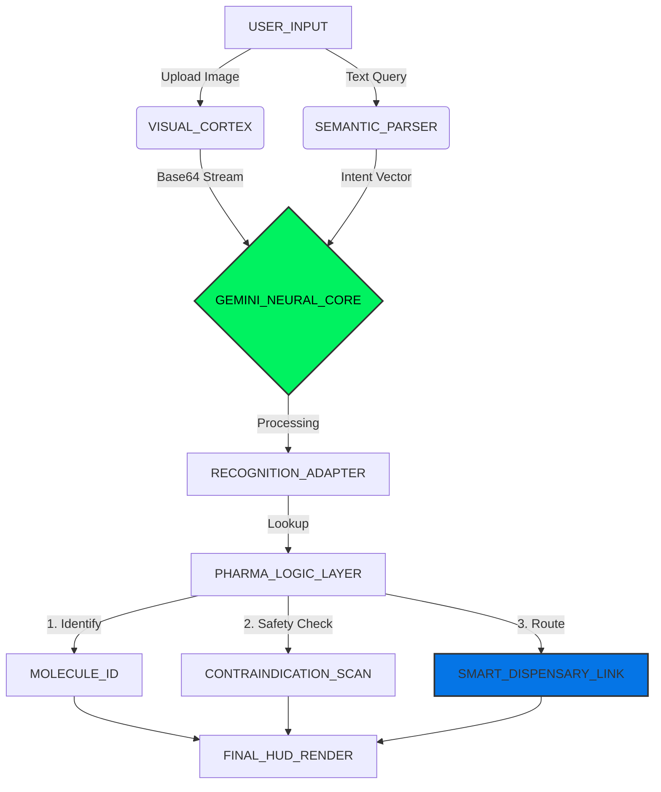

```text
██████╗ ██████╗ ██╗   ██╗ ██████╗    ██████╗ ███████╗████████╗███████╗ ██████╗████████╗
██╔══██╗██╔══██╗██║   ██║██╔════╝    ██╔══██╗██╔════╝╚══██╔══╝██╔════╝██╔════╝╚══██╔══╝
██║  ██║██████╔╝██║   ██║██║  ███╗   ██║  ██║█████╗     ██║   █████╗  ██║        ██║   
██║  ██║██╔══██╗██║   ██║██║   ██║   ██║  ██║██╔══╝     ██║   ██╔══╝  ██║        ██║   
██████╔╝██║  ██║╚██████╔╝╚██████╔╝   ██████╔╝███████╗   ██║   ███████╗╚██████╗   ██║   
╚═════╝ ╚═╝  ╚═╝ ╚═════╝  ╚═════╝    ╚═════╝ ╚══════╝   ╚═╝   ╚══════╝ ╚═════╝   ╚═╝   
```

<div align="center">
  <a href="https://drug-detect-plus.vercel.app/">
    
  </a>
</div>

<br />

<div align="center">

> `[STATUS: ONLINE]` • `[LATENCY: 48ms]` • `[MODE: HYBRID]`

<br/>

<a href="https://drug-detect-plus.vercel.app/">
  >>_ACCESS_MAIN_TERMINAL-CLICK_TO_LAUNCH-00f260?style=for-the-badge&logo=vercel&logoColor=black" />
</a>
<a href="https://github.com/manishpatil55/drug-detect-plus/issues/new?template=bug_report.md">
  
</a>

</div>

---

## 📟 // SYSTEM_MANIFEST

**Drug Detect AI** is the **Medical Singularity Engine**. 
It abandons legacy text-based search for a high-fidelity **Visual Cortex Protocol**. 

We don't "guess". We **decode reality**.
The system ingests raw photons (packaging images), vectorizes the molecular data, and outputs precise pharmacological intelligence.

### 🧬 // CORE_CAPABILITIES

| [MODULE] | [FUNCTIONALITY] | [TECH_STACK] |
| :--- | :--- | :--- |
| **VISUAL_CORTEX** | Deciphers crumpled foils, handwritten prescriptions, and 3D pill shapes. | `Gemini 2.5 Vision` |
| **LOGIC_GATE** | Analyzes multi-drug inputs for chemical contraindications (Lethal Check). | `Chain-of-Thought` |
| **VECTOR_MAP** | Normalizes fuzzy user intent ("red pill headache") to standardized nomenclature. | `Semantic Matching` |
| **SUPPLY_LINK** | Dynamically routes user to the nearest digital dispensary chain (1mg/Apollo). | `Dynamic Routing` |

---

## ⚡ // SYSTEM_ARCHITECTURE (Mermaid)


```mermaid
graph TD
    A[USER_INPUT] -->|Upload Image| B(VISUAL_CORTEX)
    A -->|Text Query| C(SEMANTIC_PARSER)
    
    B -->|Base64 Stream| D{GEMINI_NEURAL_CORE}
    C -->|Intent Vector| D
    
    D -->|Processing| E[RECOGNITION_ADAPTER]
    E -->|Lookup| F[PHARMA_LOGIC_LAYER]
    
    F -->|1. Identify| G[MOLECULE_ID]
    F -->|2. Safety Check| H[CONTRAINDICATION_SCAN]
    F -->|3. Route| I[SMART_DISPENSARY_LINK]
    
    G --> J[FINAL_HUD_RENDER]
    H --> J
    I --> J
    
    style D fill:#00f260,stroke:#333,stroke-width:2px,color:black
    style I fill:#0575E6,stroke:#333,stroke-width:2px
```

---

## 🔐 // SECURITY_AND_PRIVACY (Zero-Knowledge)

We operate on a **Stateless** protocol. 
*   **NO_DB**: No database exists. We do not store your queries.
*   **EPHEMERAL_RAM**: Images are processed in Volatile Memory and wiped instantly.
*   **METADATA_STRIP**: All EXIF data is sanitized before ingress.

**Your health data is yours. We just process the bits.**

---

## 📡 // SIGNAL_INTERCEPTION (Reporting Protocol)

Detecting system anomalies is critical for maintaining **99.9% Uptime**. 

**Initialize a Report** if you encounter **System Failure** (500) or **Resource Lock** (429).

### 🚨 [SEVERITY_LEVELS]

| Level | Status | Example | Action |
| :--- | :--- | :--- | :--- |
| **CRITICAL** | `SYSTEM_DOWN` | App crashes on load. API Key Failure. | [**OPEN PRIORITY TICKET**](https://github.com/manishpatil55/drug-detect-plus/issues/new) |
| **WARNING** | `PARTIAL_LOSS` | "Drug Interactions" loading slowly. | Submit Issue. |
| **COSMETIC** | `UI_GLITCH` | Text misalignment. Color artifact. | Submit Issue (Low Priority). |

### 📝 [BUG_REPORT_TEMPLATE]

```yaml
Current_Status: "System crashed after uploading PNG"
Device_ID: "iPhone 15 Pro / Safari"
Steps_To_Replicate:
  1. Click Upload
  2. Select Image
  3. Error: '500 Internal Server Error'
```

---

## 💾 // PATCH_NOTES (System Log)

| [VERSION] | [BUILD] | [CHANGELOG] |
| :--- | :--- | :--- |
| **v2.5.0** | `STABLE` | **[CURRENT]** Hybrid Search + Market Intelligence + UI Glassmorphism. |
| **v2.1.0** | `BETA` | Added "Drug Interaction" logic gate. |
| **v2.0.0** | `ALPHA` | Migrated from OpenAI to Gemini 2.5 Vision. |
| **v1.0.0** | `LEGACY` | Initial release. Text-only search. (Deprecated). |

---

## 🚀 // DEPLOYMENT_SEQUENCE

Ref: `Protocol_Local_Host`

### 1. CLONE_REPO
```bash
git clone https://github.com/manishpatil55/drug-detect-plus.git
cd drug-detect-plus
```

### 2. INJECT_DEPENDENCIES
```bash
pip install -r requirements.txt
```

### 3. CONFIG_VAULT
Initiate `.env` file in root directory (Level 5 Clearance):
```ini
# [CRITICAL]: Add API Keys (Comma Separated for Redundancy)
GEMINI_API_KEY=key_alpha,key_beta,key_gamma

# [CONFIG]: Model Selection
GEMINI_MODEL=gemini-2.5-flash-lite
```

### 4. IGNITE
```bash
python app.py
```
*System operational at `http://localhost:5000`*

---

## 🖥️ // VISUAL_CONFIRMATION (Interface)

**[CURRENT_BUILD_PREVIEW]:**

<div align="center">
  
</div>

---

## 👨‍💻 // OPERATOR_LOG

**Command**: [Manish Patil](https://github.com/manishpatil55)  
**Comms**: [manishpatil55@icloud.com](mailto:manishpatil55@icloud.com)  

**License**: `CC BY-NC 4.0` (Open Source / Restricted Commercial).

<br />
<div align="center">
  <code>[END_OF_TRANSMISSION]</code>
</div>
