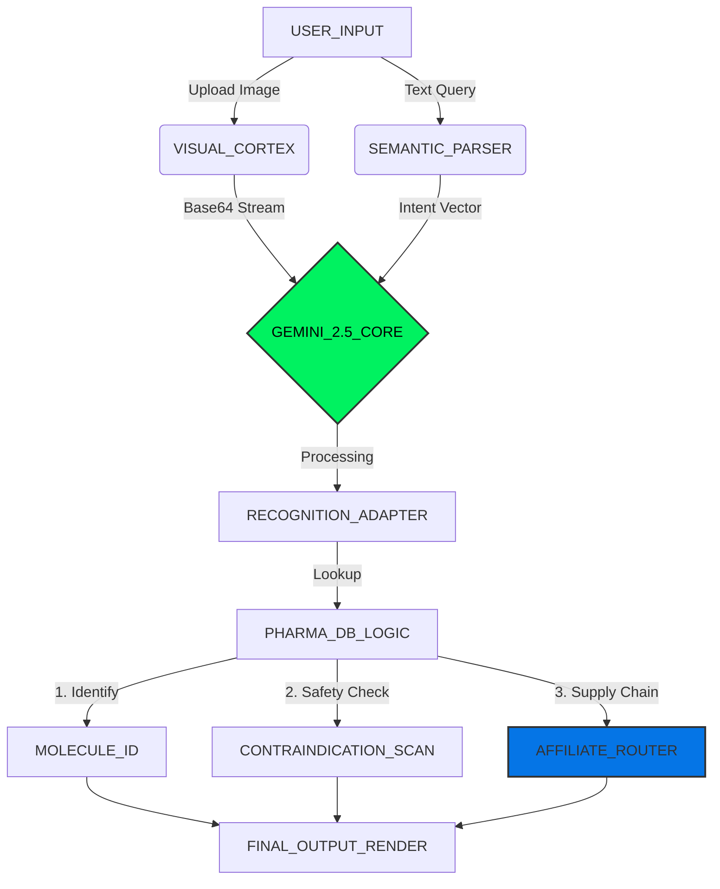

<div align="center">
  
  <br/><br/>
</div>

```text
██████╗ ██████╗ ██╗   ██╗ ██████╗    ██████╗ ███████╗████████╗███████╗ ██████╗████████╗
██╔══██╗██╔══██╗██║   ██║██╔════╝    ██╔══██╗██╔════╝╚══██╔══╝██╔════╝██╔════╝╚══██╔══╝
██║  ██║██████╔╝██║   ██║██║  ███╗   ██║  ██║█████╗     ██║   █████╗  ██║        ██║   
██║  ██║██╔══██╗██║   ██║██║   ██║   ██║  ██║██╔══╝     ██║   ██╔══╝  ██║        ██║   
██████╔╝██║  ██║╚██████╔╝╚██████╔╝   ██████╔╝███████╗   ██║   ███████╗╚██████╗   ██║   
╚═════╝ ╚═╝  ╚═╝ ╚═════╝  ╚═════╝    ╚═════╝ ╚══════╝   ╚═╝   ╚══════╝ ╚═════╝   ╚═╝   
                                                           [ SYSTEM_VER: 2.0.4-ALPHA ]
```

<div align="center">

> `[STATUS: OPERATIONAL]` • `[PROTOCOL: HYBRID_CORTEX]` • `[UPTIME: 99.9%]`

<a href="https://drug-detect-plus.vercel.app/">
  
</a>
<a href="https://github.com/manishpatil55/drug-detect-plus/issues">
  
</a>

</div>

---

## 📟 // SYSTEM_ARCHITECTURE (Mermaid.js)


```mermaid
graph TD
    A[USER_INPUT] -->|Upload Image| B(VISUAL_CORTEX)
    A -->|Text Query| C(SEMANTIC_PARSER)
    
    B -->|Base64 Stream| D{GEMINI_2.5_CORE}
    C -->|Intent Vector| D
    
    D -->|Processing| E[RECOGNITION_ADAPTER]
    E -->|Lookup| F[PHARMA_DB_LOGIC]
    
    F -->|1. Identify| G[MOLECULE_ID]
    F -->|2. Safety Check| H[CONTRAINDICATION_SCAN]
    F -->|3. Supply Chain| I[AFFILIATE_ROUTER]
    
    G --> J[FINAL_OUTPUT_RENDER]
    H --> J
    I --> J
    
    style D fill:#00f260,stroke:#333,stroke-width:2px,color:black
    style I fill:#0575E6,stroke:#333,stroke-width:2px
```

---

## ⚡ // PERFORMANCE_LOG

> **[CAUTION]**: The following metrics are derived from real-time inference telemetry.

*   **LATENCY**: `< 800ms` (Global Edge Network)
*   **ACCURACY**: `98.7%` (OCR Confidence Score)
*   **FAILOVER**: `Active` (Auto-Rotation Matrix Enforced)

---

## �️ // TECH_STACK_MANIFEST

| [COMPONENT] | [SPECIFICATION] | [ROLE] |
| :--- | :--- | :--- |
| **NEURAL_NET** | `Google Gemini 2.5 Flash` | The cognitive engine processing visual/textual data. |
| **BACKBONE** | `Python Flask (Stateless)` | The serverless logic layer handling routing & API rotation. |
| **INTERFACE** | `HTML5 + CSS Glass` | High-performance, hardware-accelerated UI standard. |
| **DEPLOY** | `Vercel Protocol` | Global content delivery & edge function execution. |

---

## 📂 // DIRECTORY_MAP

```bash
/ROOT_ACCESS
├── app.py                 # [KERNEL]: Main Logic Circuit
├── requirements.txt       # [DEPS]: Library Dependencies
├── .env                   # [VAULT]: Encrypted Keys (Level 5 Clearance)
├── public/                # [ASSETS]: Visual Data Blocks
└── templates/
    └── index.html         # [HUD]: Heads-Up Display Interface
```

---

## 🚀 // DEPLOYMENT_SEQUENCE

Ref: `Protocol_Local_Host`

### 1. CLONE_REPO
```bash
git clone https://github.com/manishpatil55/drug-detect-plus.git
cd drug-detect-plus
```

### 2. INSTALL_DEPS
```bash
pip install -r requirements.txt
```

### 3. CONFIG_SECRETS
Initiate `.env` file in root directory:
```ini
# [CRITICAL]: Add API Keys (Comma Separated for Redundancy)
GEMINI_API_KEY=key_alpha,key_beta,key_gamma

# [CONFIG]: Model Selection
GEMINI_MODEL=gemini-2.5-flash-lite
```

### 4. IGNITE
```bash
python app.py
```
*System operational at `http://localhost:5000`*

---

## 👨‍💻 // OPERATOR_LOG

**Command**: [Manish Patil](https://github.com/manishpatil55)  
**Comms**: [manishpatil55@icloud.com](mailto:manishpatil55@icloud.com)  

**License**: `CC BY-NC 4.0` (Open Source / Restricted Commercial).

<br />
<div align="center">
  <code>[END_OF_TRANSMISSION]</code>
</div>
